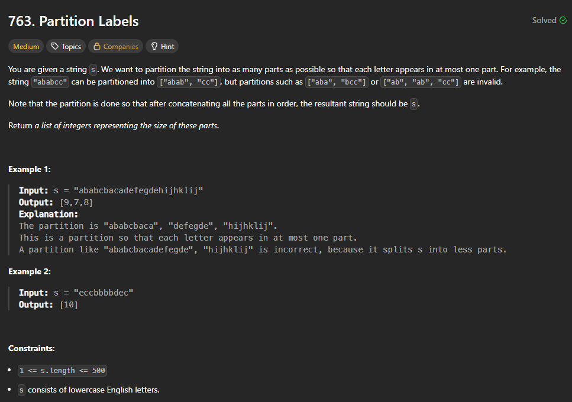
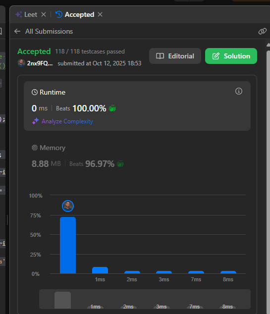
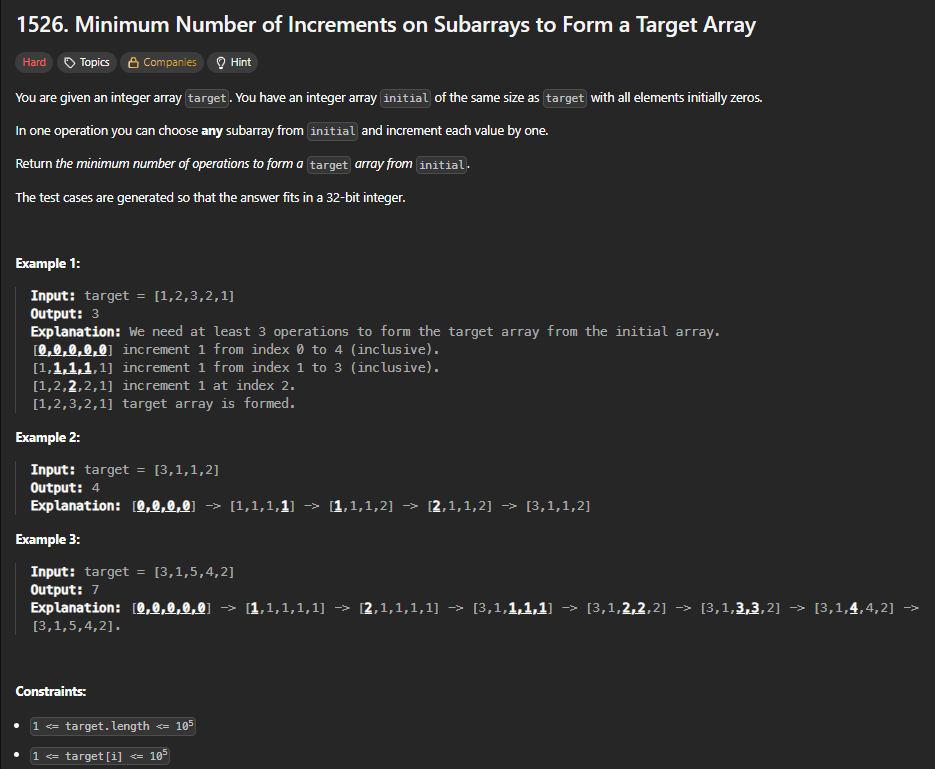
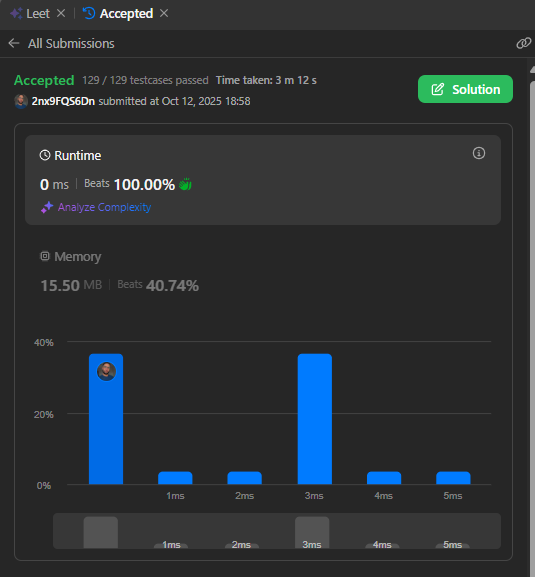
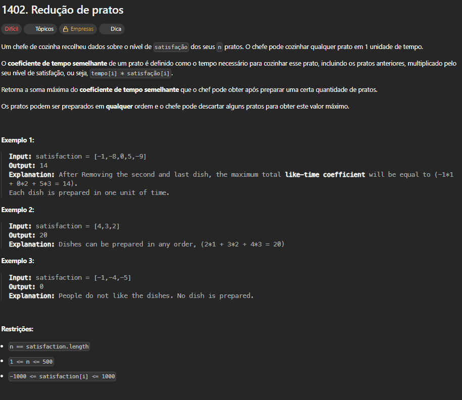
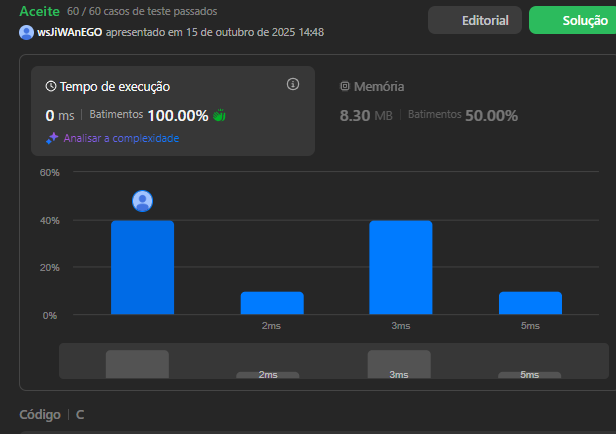

# Exercícios sobre Algoritmos Ambiciosos

**Conteúdo da Disciplina**: Algoritmos Ambiciosos 

## Alunos

|Matrícula | Aluno |
| -- | -- |
| 20/2023663 | Gabriel Basto Bertolazi |
| 20/2017503 | Wildemberg Sales da Silva Junior |

## Sobre

Esse exercício visa buscar a resolução dos exercícios escolhidos pela plataforma do LeetCode, com o objetivo de mostrar nossos conhecimentos aprendidos no conteúdo de algoritmos ambiciosos. Neles vamos aplicar conceitos e conhecimentos de lógica aprendidos na matéria de Projeto de Algoritmos com o professor Maurício Serrano.

Principais funcionalidades:
- Encontrar tamanhos de partições por meio de divisões de strings.
- Otimização de construção de arrays numéricos por meio de incrementos.
-

## Screenshots

### Visualização de Grafo → Execução de Algoritmo →  Resultado de Caminho Mínimo

#### Questão 1   

#### Questão 1 no LeetCode  

**Explicação da Resolução:** Este algoritmo didive a string várias vezes, até o menor número de partições possíveis, de forma que cada uma das letras apareça em no máximo uma partição.

---

#### Questão 2   

#### Questão 2 no LeetCode

**Explicação da Resolução:** O algoritmo calcula o número mínimo de operações que são necessárias para construir um array numérico desejado (alvo), a partir de um array de zeros.

---

#### Questão 3   

 

#### Questão 3 no LeetCode

**Explicação da Resolução:** O código busca encontrar a maior "satisfação" possível ao ser cozinhado um conjunto de pratos, ele otimiza a ordem e a seleção para maximizar o ganho priorizando os pratos com maior "satisfação".

---

## Instalação

sudo apt update && sudo apt install -y build-essential

## Uso

gcc questao_x.c -o questao_x && ./questao_x

## Apresentação

Vídeo disponível em: [youtube]()

## Outros

Para dúvidas, sugestões ou melhorias, entre em contato com os autores.
